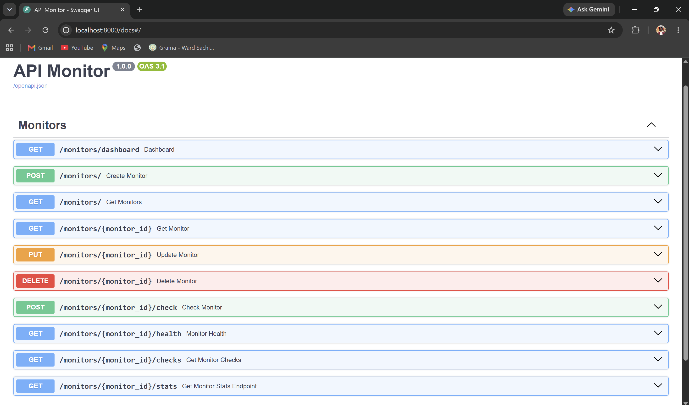
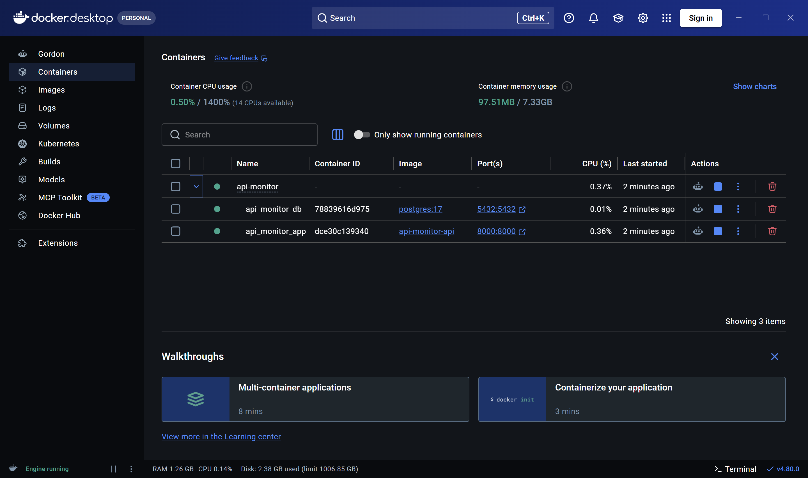
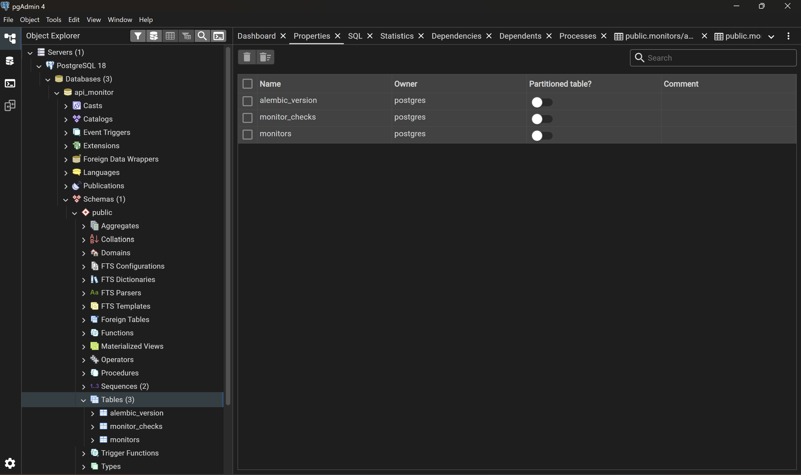
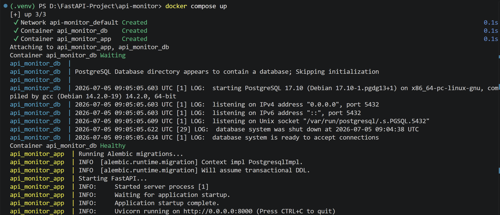

# API Monitor

A modern API monitoring system built with **FastAPI**, **PostgreSQL**, **SQLAlchemy**, **Alembic**, **Docker**, and **Pytest**.

API Monitor continuously monitors REST API endpoints, records response metrics, calculates uptime statistics, and provides monitoring insights through a RESTful API.

---

## ✨ Highlights

- 🔍 Automated API health monitoring
- ⏱️ Response time tracking
- 📊 Dashboard and uptime statistics
- 🐘 PostgreSQL database
- 🔄 Alembic database migrations
- ⚙️ APScheduler for scheduled monitoring
- 🐳 Docker & Docker Compose support
- 🧪 Unit and Integration Testing with Pytest
- 📝 Structured logging
- 📖 Interactive Swagger/OpenAPI documentation

---

## 📖 Project Overview

Modern applications depend on APIs for communication between services. Monitoring the availability and performance of these APIs is essential to ensure system reliability and quickly detect outages or performance degradation.

API Monitor is a backend application that automates API health checks by periodically sending requests to configured endpoints, storing response details in PostgreSQL, and exposing monitoring statistics through RESTful APIs.

The project was built to demonstrate modern backend engineering practices, including layered architecture, database migrations, automated testing, background scheduling, containerization with Docker, and clean project organization.

---

## ✨ Features

### 📡 API Monitoring

- Create and manage API monitors.
- Periodically monitor API endpoints using APScheduler.
- Record HTTP status codes and response times.
- Track API availability (Up/Down).

### 📊 Monitoring Dashboard

- View overall monitoring statistics.
- Calculate uptime percentage.
- Track successful and failed health checks.
- Calculate average response time.

### 🗄️ Database & Persistence

- PostgreSQL as the primary database.
- SQLAlchemy 2.0 ORM for database interactions.
- Alembic for version-controlled database migrations.

### 🧪 Testing

- Unit tests for business logic.
- Integration tests for REST API endpoints.
- Dedicated test database configuration.

### 🐳 DevOps

- Dockerized FastAPI application.
- Docker Compose for multi-container setup.
- Environment-based configuration.
- Automatic database migrations during application startup.

### 📝 Logging

- Structured application logging.
- Startup and shutdown logging.
- Scheduler activity logging.

---

---

# 📸 Application Preview

Explore the API Monitor application through its key components, including the interactive API documentation, Dockerized deployment, database schema, and application startup process.

## Interactive API Documentation

Interactive API documentation automatically generated by FastAPI using the OpenAPI specification.

<p align="center">
  
</p>

---

## Dockerized Deployment

The application and PostgreSQL database running together using Docker Compose.

<p align="center">
  
</p>

---

## PostgreSQL Database Schema

PostgreSQL database managed with Alembic migrations.

<p align="center">
  
</p>

---

## Container Startup Logs

Application startup showing PostgreSQL initialization, Alembic migrations, and FastAPI server startup.

<p align="center">
  
</p>

---

## 🏗️ Architecture

The application follows a layered architecture to keep responsibilities separated and the codebase maintainable.

```text
                        Client
                           │
                           ▼
                    FastAPI Routers
                           │
                           ▼
                     Service Layer
                           │
            ┌──────────────┴──────────────┐
            ▼                             ▼
     PostgreSQL Database           APScheduler
            │                             │
            └──────────────┬──────────────┘
                           ▼
                     Monitor Checks
```

### Architecture Overview

- **Routers** handle incoming HTTP requests and return API responses.
- **Services** contain the business logic and database operations.
- **PostgreSQL** stores monitors and monitoring history.
- **APScheduler** periodically executes API health checks in the background.
- **Alembic** manages database schema changes through version-controlled migrations.

## 🐳 Docker Architecture

The application is containerized using Docker Compose, with separate containers for the API and the PostgreSQL database.

```text
                  Docker Compose
                         │
        ┌────────────────┴────────────────┐
        │                                 │
┌──────────────────┐            ┌──────────────────┐
│   FastAPI API    │◄──────────►│    PostgreSQL    │
│                  │  Network   │                  │
│ APScheduler      │            │ Persistent Data  │
│ Alembic          │            │ Docker Volume    │
└──────────────────┘            └──────────────────┘
```

Application startup sequence:

1. PostgreSQL starts.
2. Docker waits until PostgreSQL is healthy.
3. Alembic applies pending database migrations.
4. FastAPI starts the application.
5. APScheduler begins monitoring configured APIs.

---

## 🛠️ Tech Stack

| Category | Technology |
|----------|------------|
| **Language** | Python 3.13 |
| **Framework** | FastAPI |
| **Database** | PostgreSQL |
| **ORM** | SQLAlchemy 2.0 |
| **Database Migrations** | Alembic |
| **Background Scheduler** | APScheduler |
| **Testing** | Pytest |
| **Containerization** | Docker & Docker Compose |
| **API Documentation** | Swagger UI / OpenAPI |
| **Configuration** | Pydantic Settings |
| **Web Server** | Uvicorn |

---

## 📂 Project Structure

The project follows a modular, layered architecture that separates API routing, business logic, database access, scheduling, and configuration into dedicated modules. This structure improves maintainability, scalability, and testability.

```text
api-monitor/
├── alembic/                      # Database migrations
├── app/
│   ├── core/                     # Configuration and logging
│   ├── db/                       # Database connection and session management
│   ├── models/                   # SQLAlchemy ORM models
│   ├── routers/                  # FastAPI API endpoints
│   ├── scheduler/                # Background monitoring scheduler
│   ├── schemas/                  # Pydantic request and response schemas
│   ├── services/                 # Business logic
│   └── main.py                   # FastAPI application entry point
├── tests/                        # Unit and integration tests
├── .dockerignore
├── .env.example                  # Sample environment variables
├── .gitignore
├── alembic.ini                   # Alembic configuration
├── docker-compose.yml            # Multi-container configuration
├── Dockerfile                    # FastAPI container image
├── entrypoint.sh                 # Container startup script
├── README.md
└── requirements.txt              # Python dependencies
```